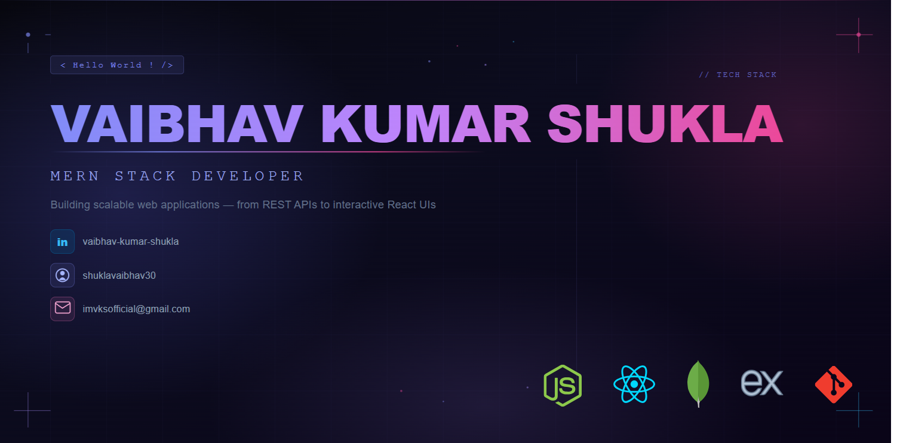

<!--
**shuklavaibhav30/shuklavaibhav30** is a ✨ _special_ ✨ repository because its `README.md` (this file) appears on your GitHub profile.

Here are some ideas to get you started:

- 🔭 I’m currently working on ...
- 🌱 I’m currently learning ...
- 👯 I’m looking to collaborate on ...
- 🤔 I’m looking for help with ...
- 💬 Ask me about ...
- 📫 How to reach me: ...
- 😄 Pronouns: ...
- ⚡ Fun fact: ...
-->

  

## 🚀 About Me

* 🎓 Computer Science Undergraduate
* 💻 MERN Stack Developer
* 🧠 DSA & Problem Solving Enthusiast
* 🌐 Full Stack Web Developer
* 🔨 Building projects with React, Node.js, Express & MongoDB
* 📚 Learning Backend Development & System Design

## 🚀 Tech Stack

## 📊 GitHub Stats

  

  

  

## 🏆 LeetCode

  

## 🐍 Contribution Snake

  

## Connect With Me

🔗 LinkedIn
https://www.linkedin.com/in/vaibhav-kumar-shukla-445b3a300/

📧 Email
[imvksofficial@gmail.com](mailto:imvksofficial@gmail.com)
